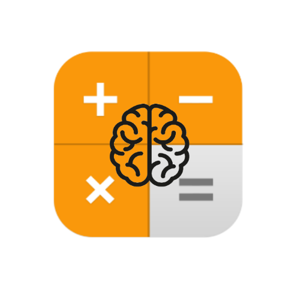

#Brain Calc
# Calc-Game-Understanding-Fragments-Kotlin-Intermediate
 
Using  
=> Kotlin  
=> Implicit intent for share scores  
=> Model View View-Model (mvvm - architecture) 
=> View Binding 
=> Fragments 

=> Back Stack 
=> App drawer 
=> Options Menu 
=> Custom Snackbar 
=> Input method manager 
 

Understanding fragments by Android Trivia App provided by google seemed to be pretty basic and I was not actually getting results... so started a new project created my own fragments and view models... Added some custom snack bar and basic game functions... it's pretty now

  
screenShots

  
  
  
  
  
  
  

